# expense-diary 

A simple Django application to keep track of your monthly expenses. It also provides detailed comparison against expenses in past months.


- [expense-diary](#expense-diary)
  - [Usage](#usage)
    - [Add Expense](#add-expense)
    - [Humanizing expenses](#humanizing-expenses)
    - [Details of an Expense](#details-of-an-expense)
    - [Deleting an Expense](#deleting-an-expense)
    - [Deleting all expenses in a month](#deleting-all-expenses-in-a-month)
    - [Updating an Expense](#updating-an-expense)
    - [Ordering of Expense Items](#ordering-of-expense-items)
    - [Expenses in the past month](#expenses-in-the-past-month)
    - [Visualizing monthly expenses](#visualizing-monthly-expenses)
    - [Expense Badges](#expense-badges)
    - [Pagination](#pagination)
  - [Testing](#testing)
  - [](#)


## Usage

### Add Expense

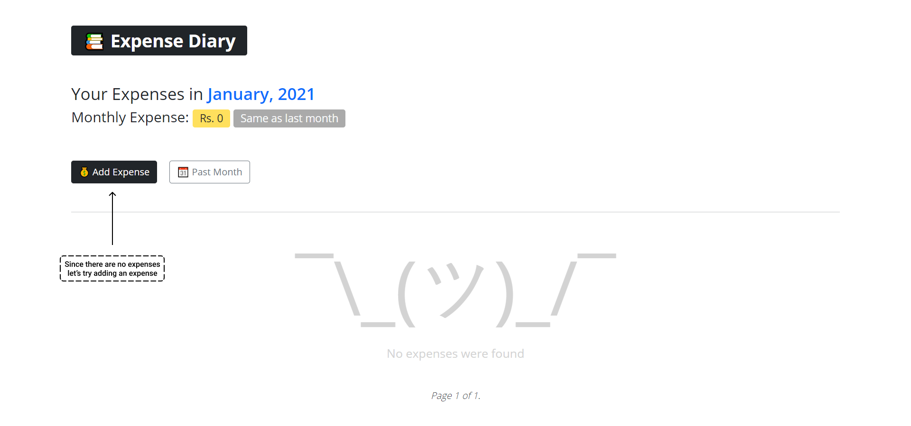
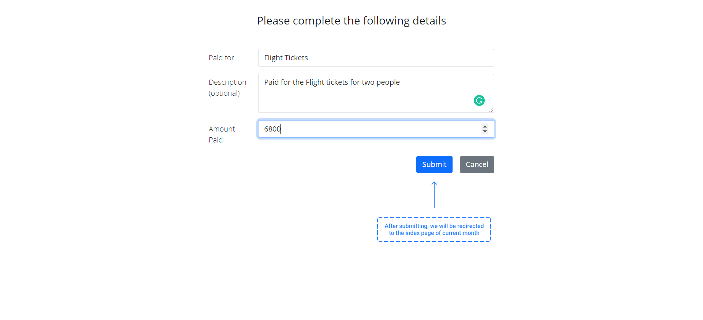
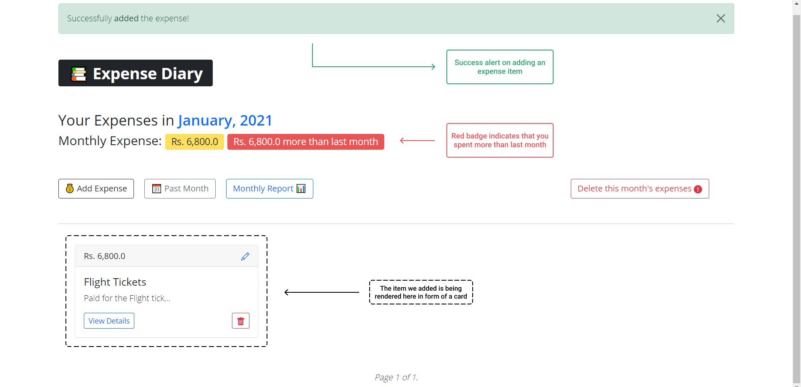

### Humanizing expenses

For better readability, we "humanize" the large amounts.

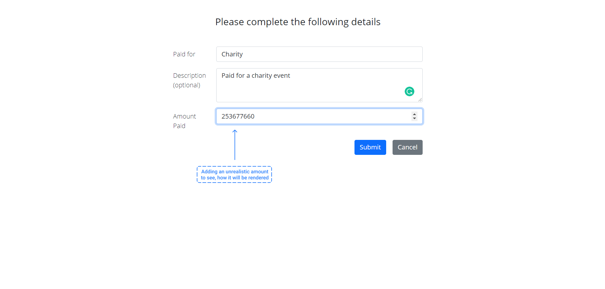
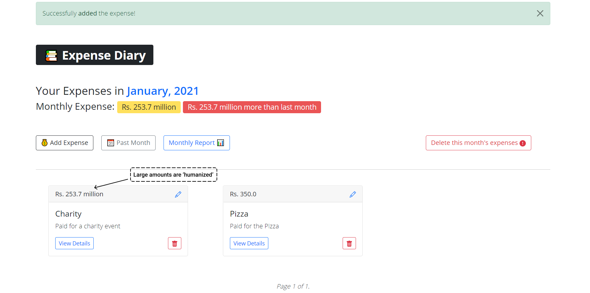

### Details of an Expense

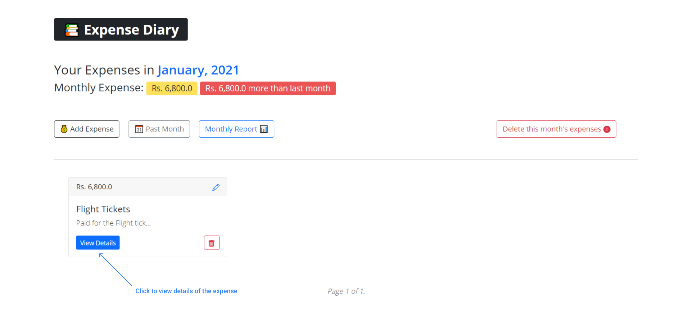
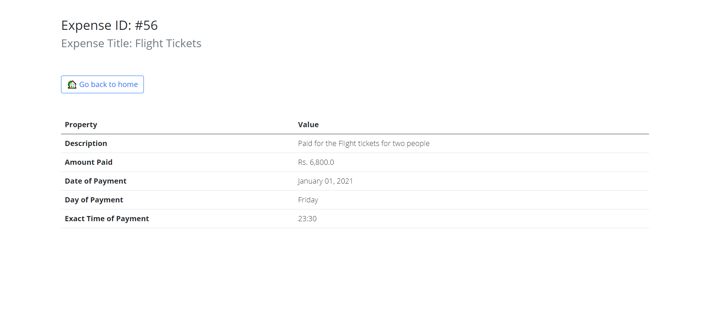

### Deleting an Expense

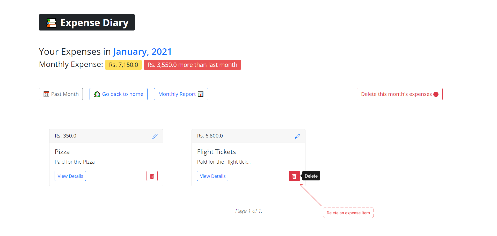
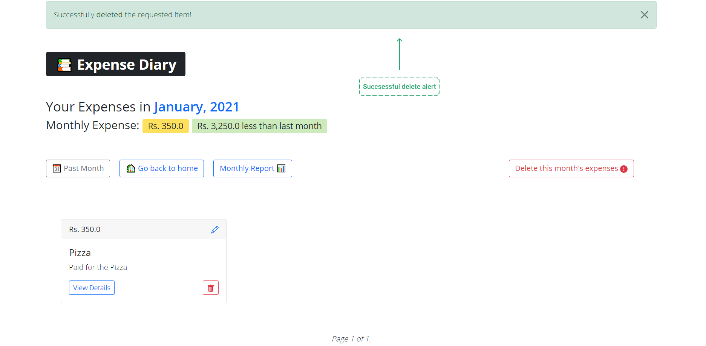

### Deleting all expenses in a month

In case you want to delete all the expenses in a month, you can do that too.

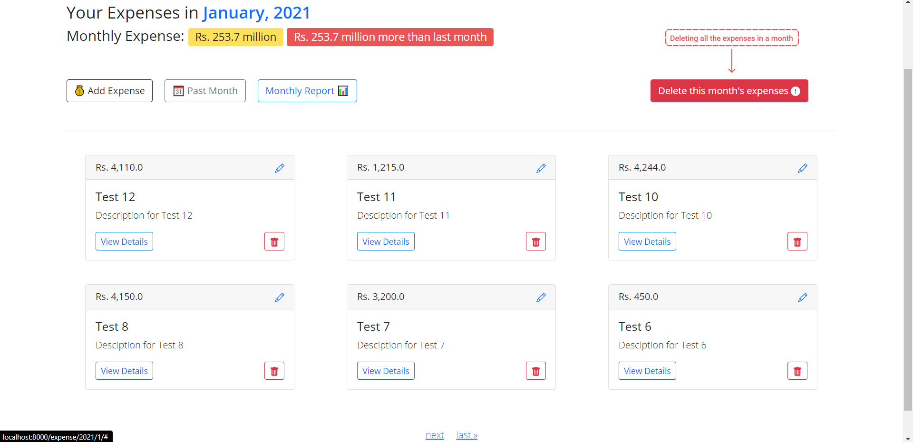
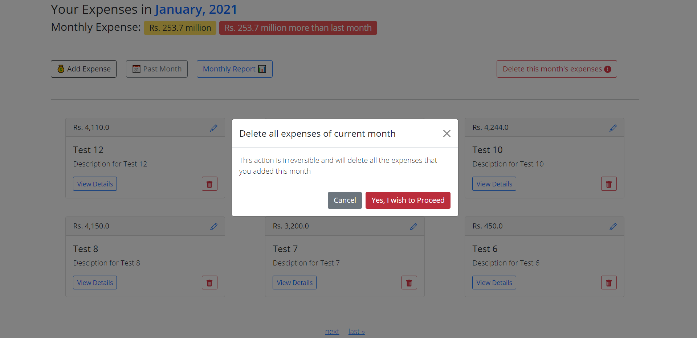
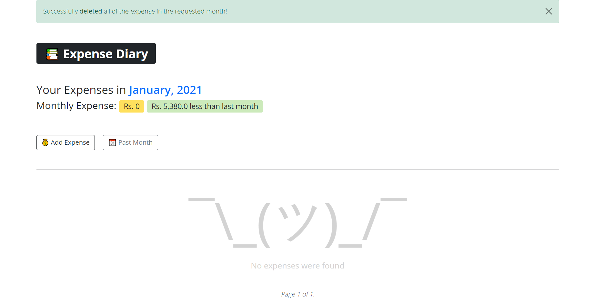

### Updating an Expense

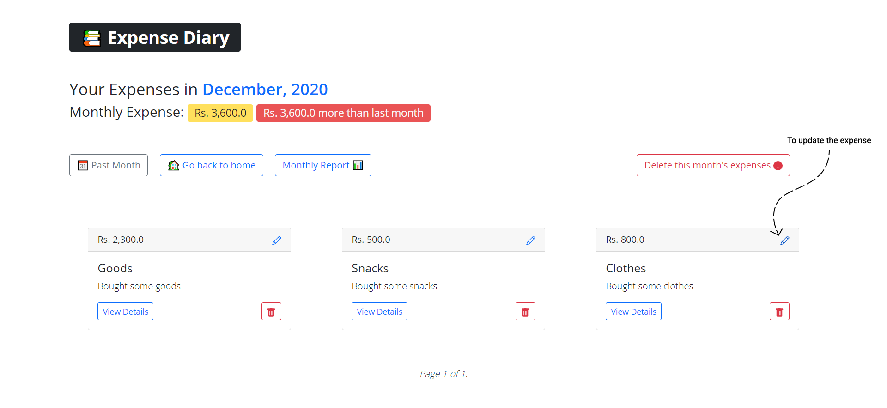
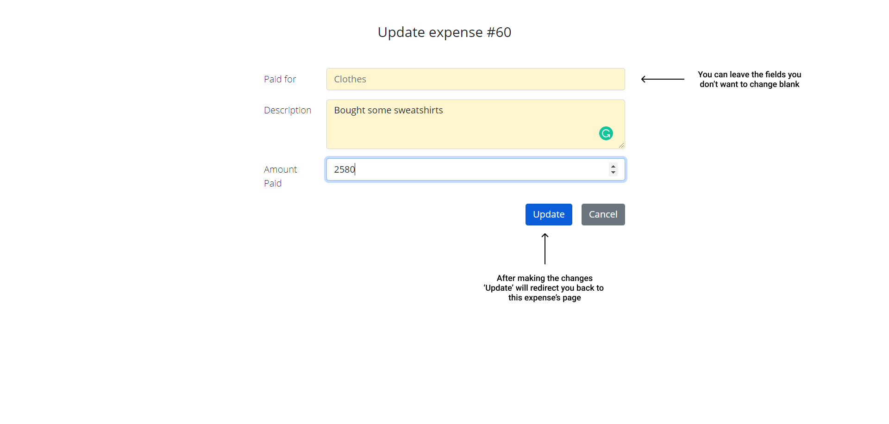
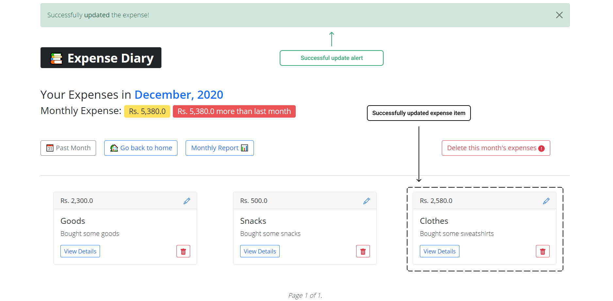

### Ordering of Expense Items
Expense item cards are ordered by "recent". The most recently added card shows up at front.


### Expenses in the past month

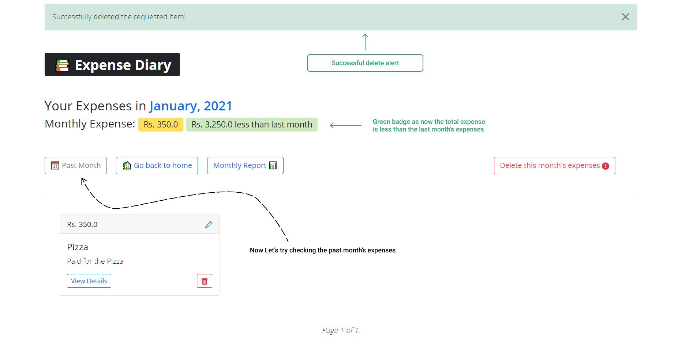
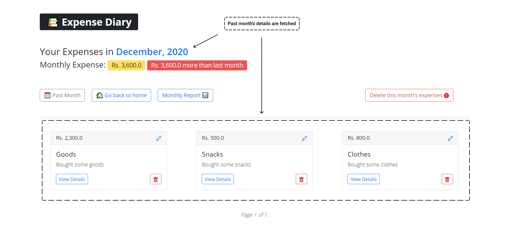


### Visualizing monthly expenses
We can also visualize the expenses in form of a nice line chart

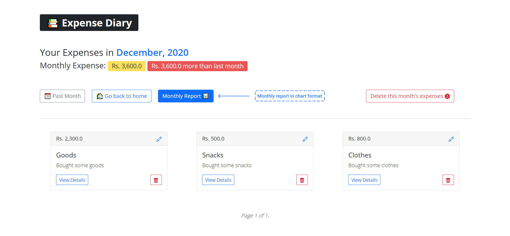
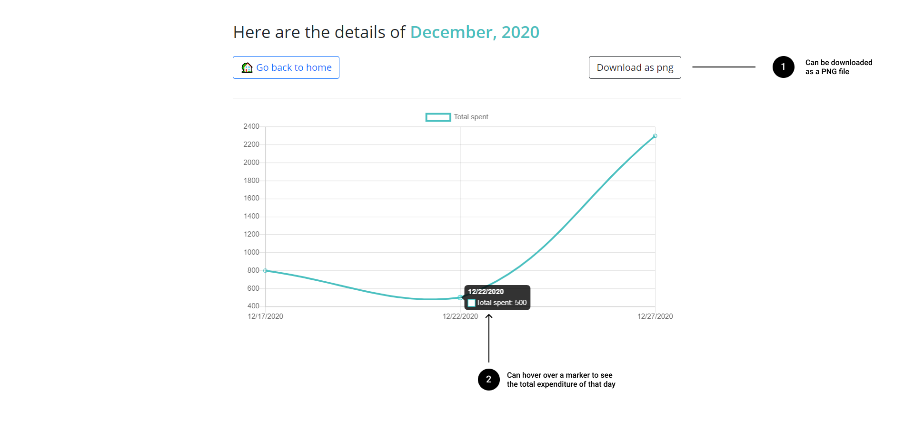

### Expense Badges
There are badges to indicate how much you spent compared to the last month

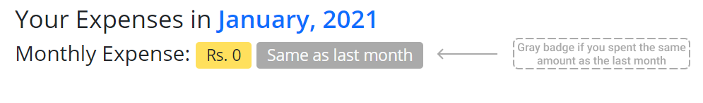
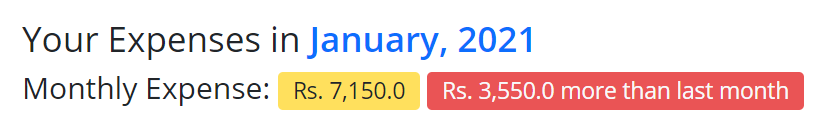


### Pagination
If you have added enough items you will see the pagination links at the bottom to help you navigate across the pages

| First Page | Second Page | Third Page |
:-------------------------:|:-------------------------:|:-------------------------:
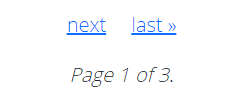  |  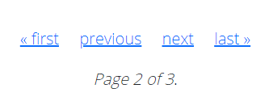 | 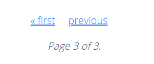


## Testing

```python
python manage.py test expenses
```
## 